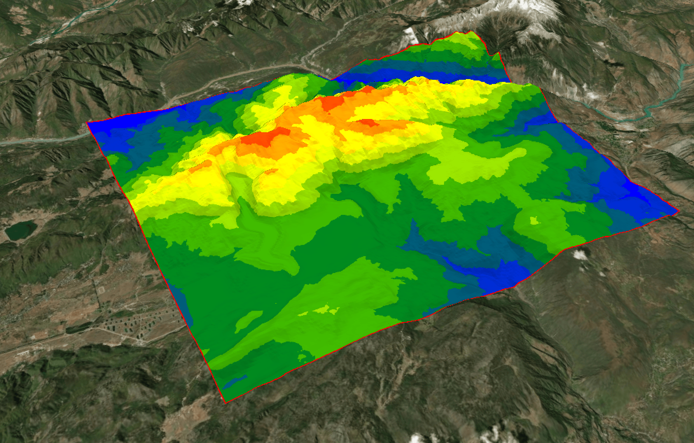

Cesium-isosurface
---

基于Cesium的等高面分析｜Isosurface analysis based on Cesium


## 截图｜Screenshot




## 安装｜Install

```bash
npm i ceium-isosurface
```


## 使用｜Usage

```js
import {Viewer} from 'cesium'
import {Isosurface} from 'ceium-isosurface'

const viewer = new Cesium.Viewer('cesiumContainer')
const analyser = new Isosurface(viewer.terrainProvider, {
  width: 1500,
  colors: genColors(10),
  breakCount: 10,
});

const positionsCartesian3 = [...]
analyser.analyse(positionsCartesian3, 50).then(e =>{
  viewer.entities.add(e);
  viewer.zoomTo(e);
});
```


